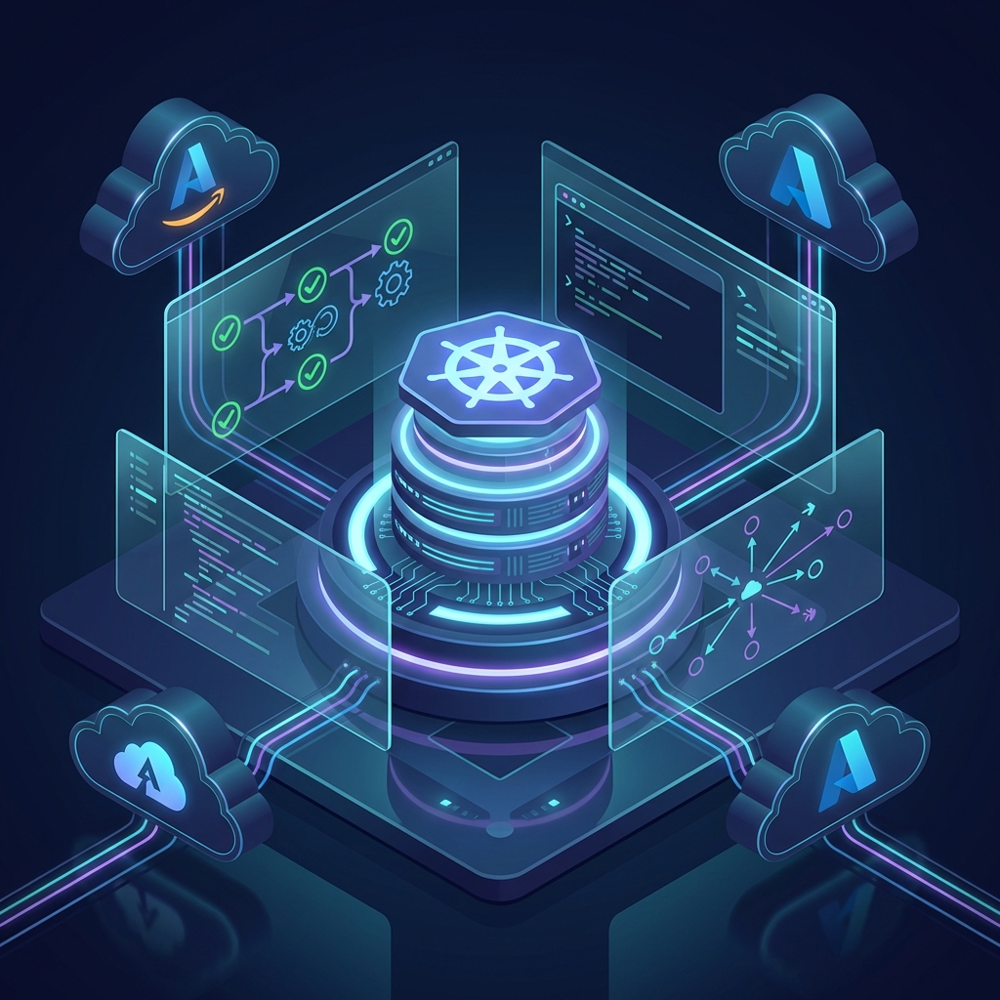

  

  

  

    
    &nbsp;
    
    &nbsp;
    
    &nbsp;
    
  

 

<table>
  <tr>
    <td width="55%" align="top">

### ⚡ About Me

I am a **DevOps Lead** with **14+ years** of hands-on experience in designing and managing scalable, secure, and highly available cloud infrastructures. 

- 🔭 I’m currently working on **Advanced EKS Architectures and Platform Engineering**.
- 🌱 I’m currently exploring **GitOps at scale and AI in DevOps**.
- 💬 Ask me about **AWS, Kubernetes, Terraform, and CI/CD**.
- ⚡ Fun fact: **I can debug YAML with my eyes closed.** (Well, almost).

### 🚀 Core Competencies

- **Cloud Architecture**: AWS, Azure, GCP
- **Orchestration**: Kubernetes (EKS), Docker
- **IaC**: Terraform, Ansible, CloudFormation
- **Observability**: Prometheus, Grafana, Datadog
- **Security**: DevSecOps, Compliance, Governance

    </td>
    <td width="45%" align="center">

 

   </td>
  </tr>
</table>

 

### 🛠️ Technology Stack

| Cloud & Platforms | Containers & Orchestration | IaC & Automation |
|:---:|:---:|:---:|
|  |  |  |

| CI/CD & DevOps | Languages | Databases & Monitoring |
|:---:|:---:|:---:|
|  |  |  |

 

###  GitHub Analytics

  

 

  

 

###  Achievements & Productivity

  
   
  

 

  

    
  

  

